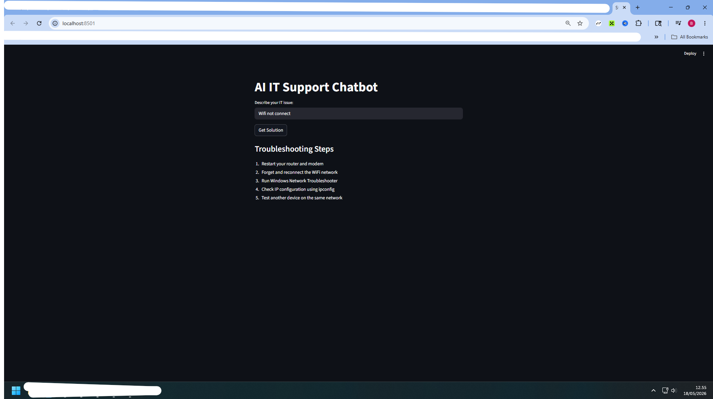

# AI IT Support Chatbot

Interactive IT troubleshooting chatbot built using Python and Streamlit.

## Features

- IT troubleshooting assistant
- Hardware issue guidance
- Network troubleshooting
- System performance suggestions
- Interactive chatbot interface

## Technologies

- Python
- Streamlit

## Run Project

streamlit run app.py

## Screenshot

